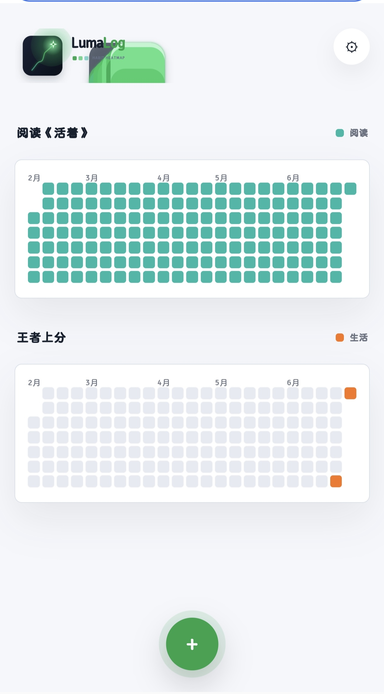
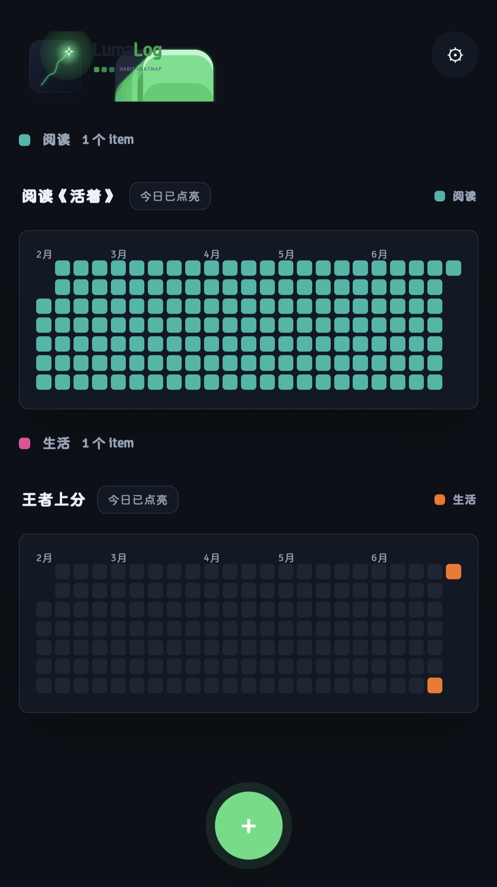
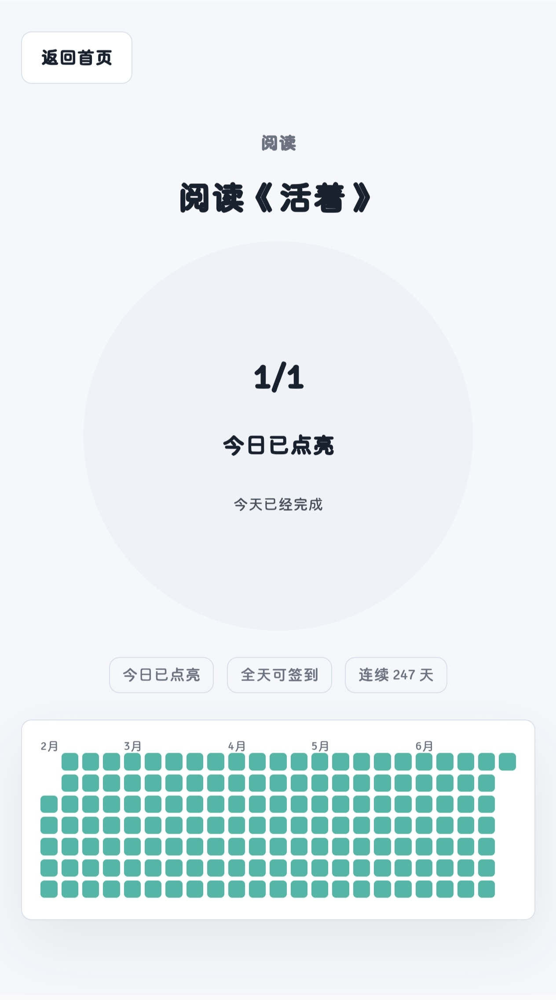
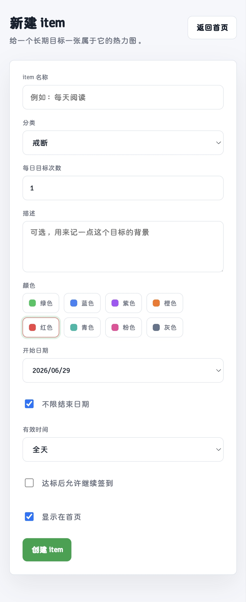
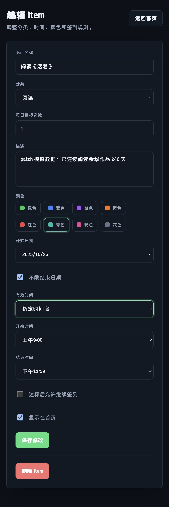
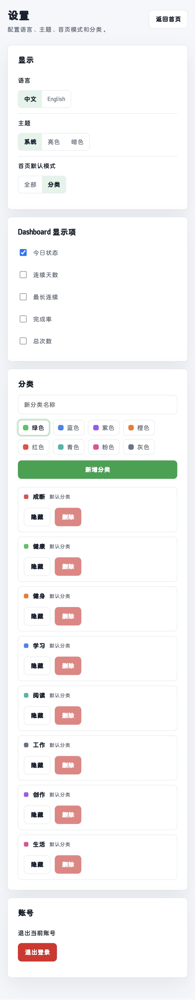

# LumaLogFrontEnd

LumaLog 是一个以“贡献热力图”为核心视觉表达的极简 habit 签到应用。用户可以为阅读、健身、学习、戒断、健康管理等长期目标创建独立的 habit，并通过每日签到点亮对应的热力图，让坚持这件事变得更直观、更有反馈感。

本仓库是 LumaLog 的 Web 前端项目，基于 Vue 3 + Vite 构建，负责登录注册、habit 管理、首页热力图展示、签到页、设置页、暗亮主题与中英文切换等交互体验。

## 项目预览

### 首页

首页集中展示用户创建的 habit，每个 habit 以 GitHub 风格的贡献热力图呈现最近一段时间的签到状态。





### 签到页

签到页保留核心动作：查看 habit 名称，并通过居中的圆形模块完成当日点亮。若 habit 配置了有效时间段，页面会根据当前时间提示是否可签到。



### 新增与编辑

用户可以为 habit 配置名称、分类、颜色、有效时间段、签到目标、有限天数或不限天数等信息。





### 设置页

设置页支持主题切换、语言切换、首页统计信息显示配置等偏好设置。



## 核心功能

- Habit 首页：展示当前用户的所有 habit 及其贡献热力图。
- 分类视图：支持戒断、健康、健身、学习等默认分类，也可扩展自定义分类。
- 每日签到：根据 habit 规则完成点亮，支持有效时间段限制。
- 热力图可视化：用不同深浅的色块表达签到次数和完成状态。
- Habit 配置：支持名称、分类、颜色、有效时间段、签到次数、持续天数等配置。
- 个性化设置：支持暗亮主题、中英文切换，以及统计信息显示开关。
- 响应式适配：桌面端展示完整热力图，移动端优先展示最近月份数据。

## 技术栈

- Vue 3
- Vite
- TypeScript
- Vue Router
- Pinia
- CSS Variables
- Fetch API

## 项目结构

```text
LumaLogFrontEnd
├─ public
│  └─ favicon.ico
├─ resource
│  └─ 页面截图资源
├─ src
│  ├─ api          # 接口请求封装
│  ├─ assets       # 前端静态资源
│  ├─ components   # 通用组件
│  ├─ i18n         # 中英文文案
│  ├─ router       # 路由配置
│  ├─ stores       # Pinia 状态管理
│  ├─ views        # 页面视图
│  ├─ App.vue
│  └─ main.ts
├─ index.html
├─ package.json
└─ vite.config.ts
```

## 本地运行

```bash
npm install
npm run dev
```

默认后端接口地址：

```text
http://localhost:8080/api
```

如需修改接口地址，可在 `.env` 中配置：

```text
VITE_API_BASE_URL=http://localhost:8080/api
```

## 构建

```bash
npm run build
```

## 关联项目

- `LumaLogBackEnd`：基于 Gin + PostgreSQL 的后端服务。
- `LumaLogApp`：Android 本地离线版应用。
