# LumaLogFrontEnd

LumaLogFrontEnd 是 LumaLog 的 Web 前端项目，基于 Vue 3 + Vite 构建。产品围绕“习惯热力图”展开，帮助用户为阅读、运动、学习、健康、创作等长期目标建立独立记录，并通过每日签到、补签、统计和分享图生成，让坚持变得清晰可见。

当前 `resource` 目录已更新为最新界面图，README 中的预览图也已同步到新的文件名与界面状态。

## 项目预览

### 首页

首页用于集中展示用户的习惯列表、今日状态、连续天数、完成率和热力图概览。当前资源同时提供亮色与暗色主题界面。

<table>
  <tr>
    <td align="center"></td>
    <td align="center"></td>
  </tr>
  <tr>
    <td align="center">首页 - 亮色主题</td>
    <td align="center">首页 - 暗色主题</td>
  </tr>
</table>

### 签到与补签

签到页聚焦单个习惯的完成状态，支持今日签到、备注记录、签到历史和分享图生成。补签页用于选择可补签日期，帮助用户修正遗漏记录。

<table>
  <tr>
    <td align="center"></td>
    <td align="center"></td>
    <td align="center">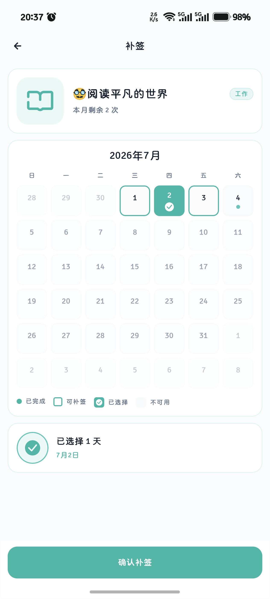</td>
  </tr>
  <tr>
    <td align="center">已签到 - 亮色主题</td>
    <td align="center">未签到 - 暗色主题</td>
    <td align="center">补签日历</td>
  </tr>
</table>

### 编辑与设置

用户可以编辑习惯名称、描述、图标、分类、颜色、目标规则和显示配置。设置页提供首页显示、主题、分类、归档习惯和数据导入导出等管理入口。

<table>
  <tr>
    <td align="center">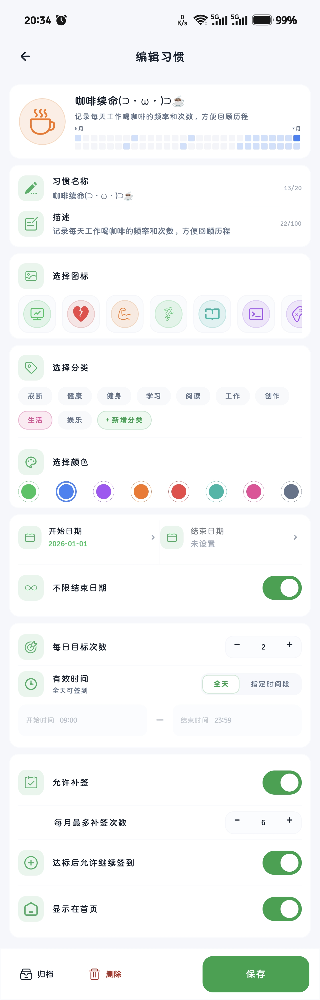</td>
    <td align="center">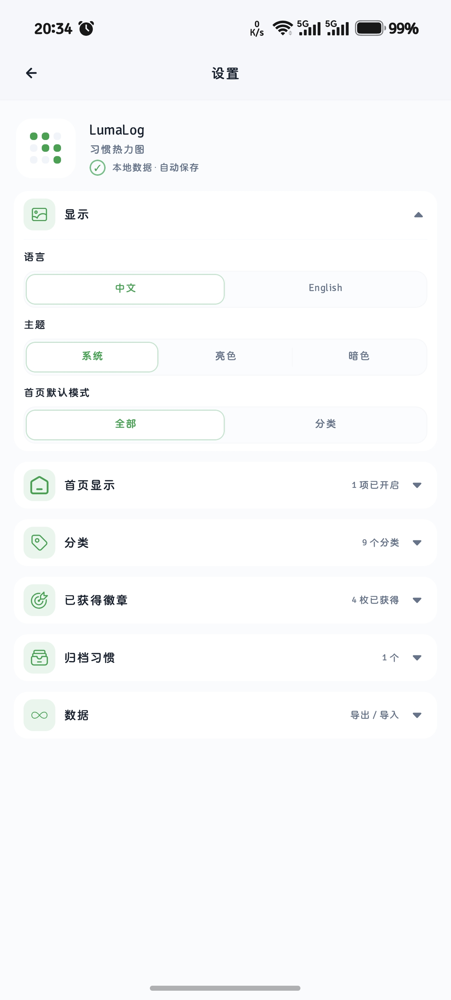</td>
  </tr>
  <tr>
    <td align="center">编辑习惯</td>
    <td align="center">设置中心</td>
  </tr>
</table>

### 分享图模板

LumaLog 支持将习惯热力图生成分享图，并提供 4 套模板。每套模板都有亮色与暗色版本，适合在不同场景下保存或分享。

<table>
  <tr>
    <td align="center">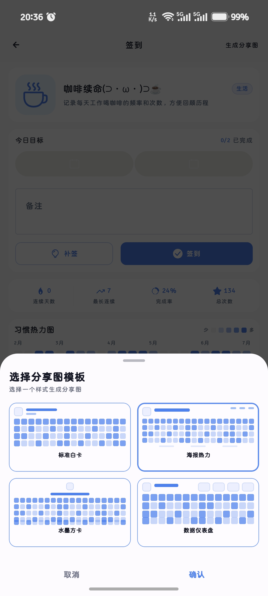</td>
  </tr>
  <tr>
    <td align="center">分享图模板选择弹窗</td>
  </tr>
</table>

#### 亮色模板

<table>
  <tr>
    <td align="center">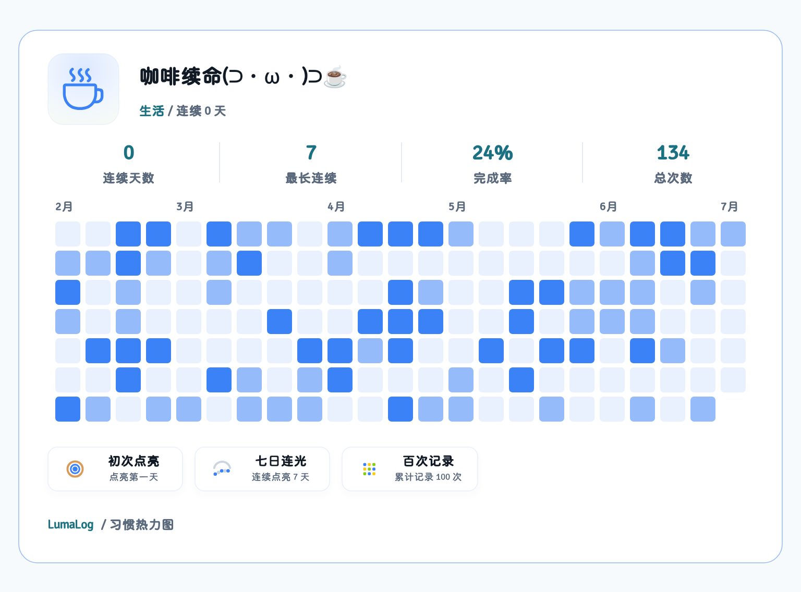</td>
    <td align="center">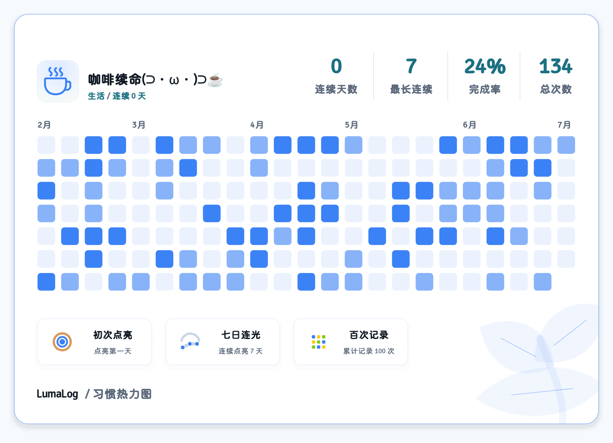</td>
  </tr>
  <tr>
    <td align="center">模板 1 - 亮色</td>
    <td align="center">模板 2 - 亮色</td>
  </tr>
  <tr>
    <td align="center">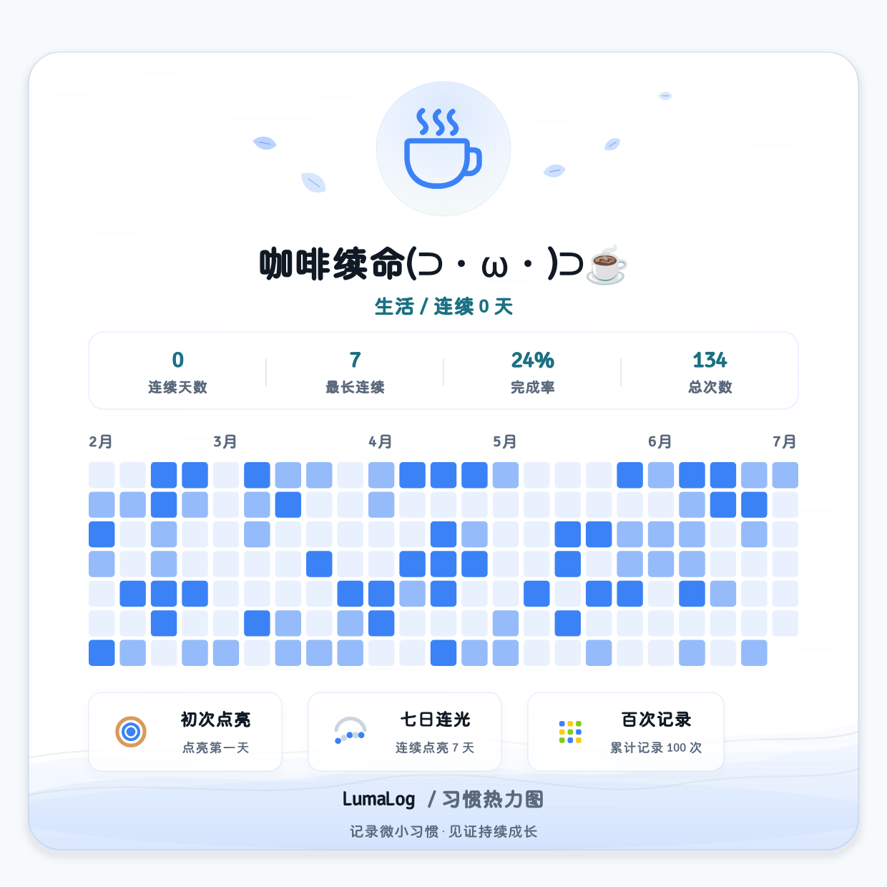</td>
    <td align="center">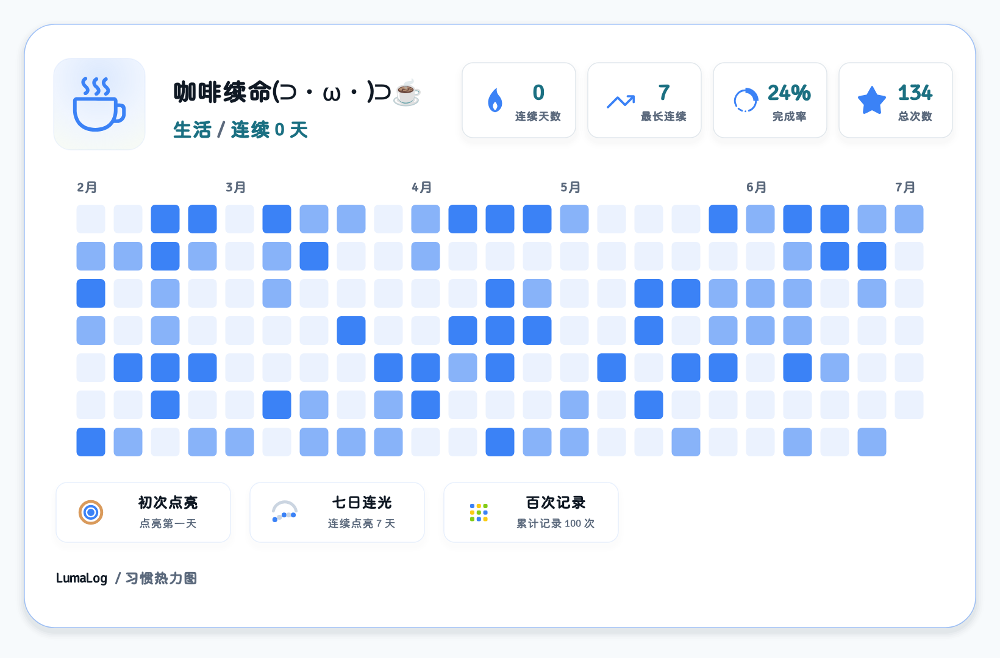</td>
  </tr>
  <tr>
    <td align="center">模板 3 - 亮色</td>
    <td align="center">模板 4 - 亮色</td>
  </tr>
</table>

#### 暗色模板

<table>
  <tr>
    <td align="center">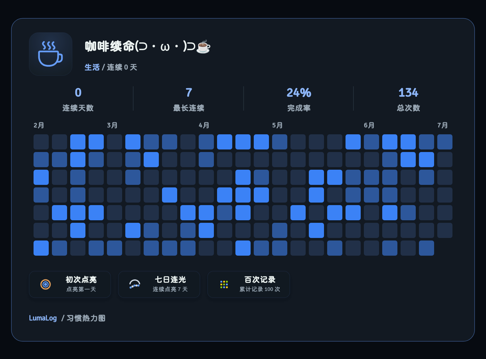</td>
    <td align="center">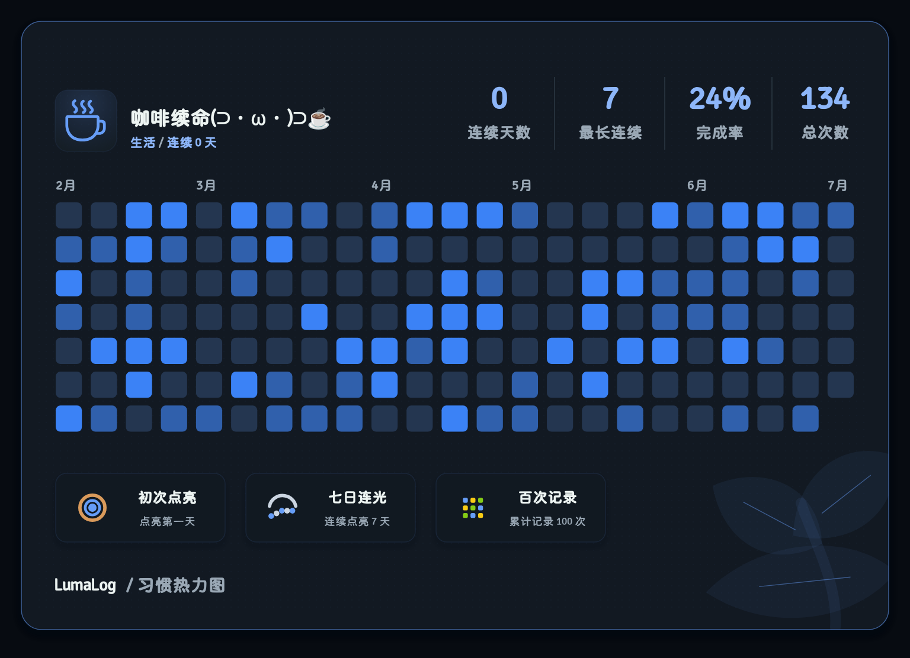</td>
  </tr>
  <tr>
    <td align="center">模板 1 - 暗色</td>
    <td align="center">模板 2 - 暗色</td>
  </tr>
  <tr>
    <td align="center">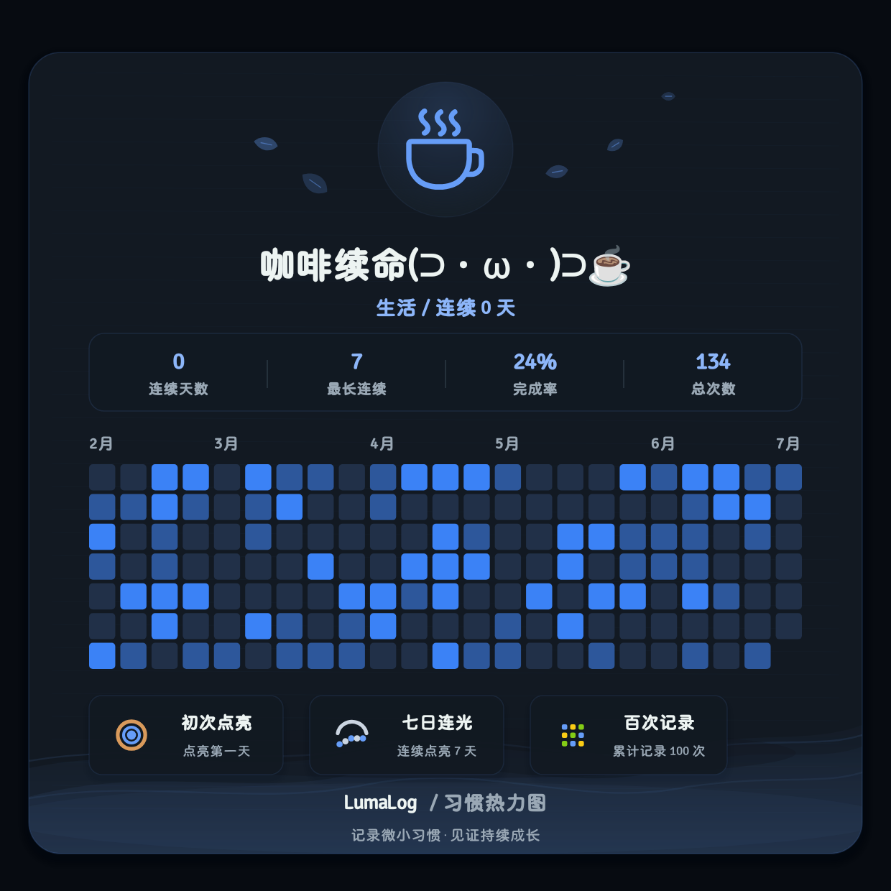</td>
    <td align="center"></td>
  </tr>
  <tr>
    <td align="center">模板 3 - 暗色</td>
    <td align="center">模板 4 - 暗色</td>
  </tr>
</table>

## 核心功能

- 账号体系：支持登录、注册，并通过本地 token 访问受保护页面。
- 习惯管理：支持创建、编辑、删除、归档习惯，配置名称、描述、分类、图标、颜色和有效日期。
- 每日签到：支持普通签到、重复记录、备注、今日状态提示和签到历史。
- 补签日历：按月展示可补签日期，支持补签次数限制与批量确认。
- 热力图可视化：用类似贡献图的方式展示长期坚持情况，直观看到每日完成状态。
- 数据统计：展示连续天数、最长连续、完成率、总次数、今日目标等指标。
- 分享图生成：支持 4 套分享图模板，并区分亮色与暗色主题。
- 个性化设置：支持亮色、暗色、跟随系统主题，中英文切换，首页默认显示模式和统计项开关。
- 分类管理：内置常用分类，也支持自定义分类。
- 数据能力：设置页提供数据导入、导出入口，便于备份和迁移。

## 技术栈

- Vue 3
- Vite
- TypeScript
- Vue Router
- Pinia
- CSS Variables
- Fetch API
- Vitest
- Cypress
- ESLint / Oxlint / Prettier

## 项目结构

```text
LumaLogFrontEnd
|-- public
|   `-- favicon.ico
|-- resource                 # README 与宣传使用的最新界面截图
|-- src
|   |-- api                  # 接口请求封装
|   |-- assets               # 静态资源、图标、徽章
|   |-- components           # 通用组件
|   |-- i18n                 # 中英文文案
|   |-- router               # 路由配置
|   |-- stores               # Pinia 状态管理
|   |-- types                # TypeScript 类型定义
|   |-- utils                # 日期、颜色、图标、状态等工具
|   |-- views                # 页面视图
|   |-- App.vue
|   `-- main.ts
|-- index.html
|-- package.json
`-- vite.config.ts
```

## 本地运行

项目要求 Node.js 版本满足：

```text
^22.18.0 || >=24.12.0
```

安装依赖：

```bash
npm install
```

启动开发服务：

```bash
npm run dev
```

后端接口地址通过 `VITE_API_BASE_URL` 配置。可以参考 `.env.example` 新建本地环境配置：

```text
VITE_API_BASE_URL=http://192.168.31.215:8080/api
```

## 常用脚本

```bash
npm run dev          # 启动开发服务
npm run build        # 类型检查并构建生产包
npm run preview      # 预览构建产物
npm run test:unit    # 运行单元测试
npm run test:e2e     # 运行端到端测试
npm run lint         # 运行代码检查
```

## 构建

```bash
npm run build
```

构建产物会输出到 `dist` 目录。

## 截图资源说明

`resource` 目录中的图片用于 README 展示、应用介绍和宣传物料制作。当前图片包括：

- 首页：`首页-亮色.jpg`、`首页-暗色.jpg`
- 签到页：`签到页-已签到-亮色.jpg`、`签到页-未签到-暗色.jpg`
- 补签页：`补签页-亮色.jpg`
- 编辑页：`编辑页-亮色.jpg`
- 设置页：`设置页-亮色.jpg`
- 分享图模板弹窗：`分享图模板弹窗.jpg`
- 分享图模板：`分享图-模板1-亮色.png` 到 `分享图-模板4-暗色.png`

如果后续替换截图但保持文件名不变，README 会自动展示新图；如果文件名再次变更，需要同步更新本文件中的图片路径。

## 关联项目

- `LumaLogBackEnd`：LumaLog 后端服务。
- `LumaLogApp`：LumaLog Android 应用。
- `宣传相关`：产品文档、技术架构文档、宣传文档和宣传图正稿。
